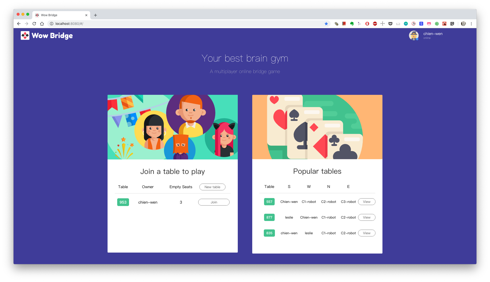
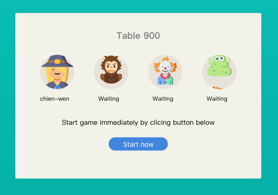
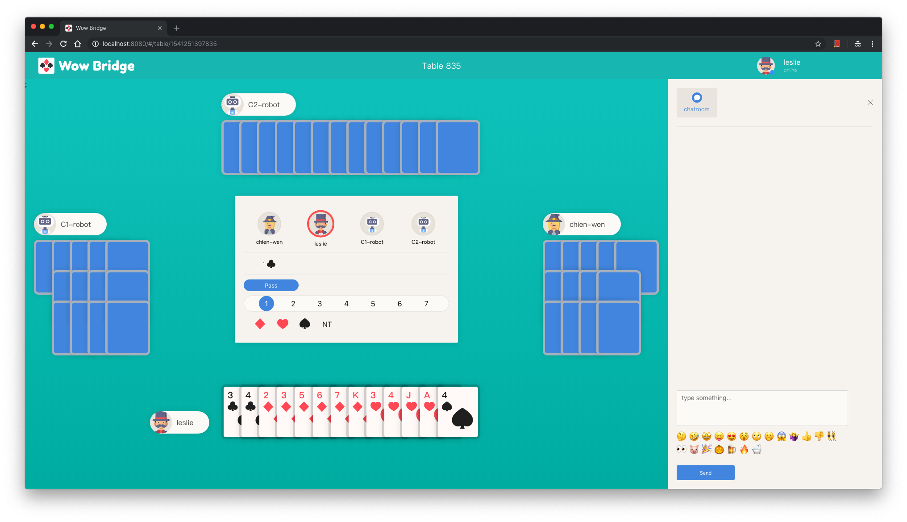
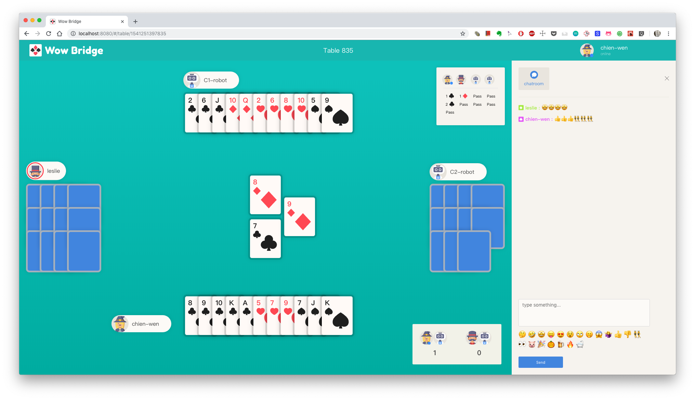
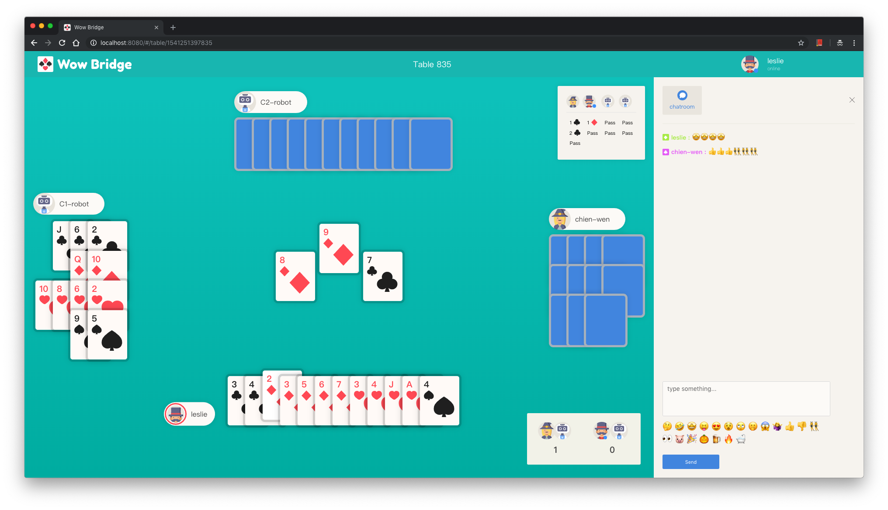
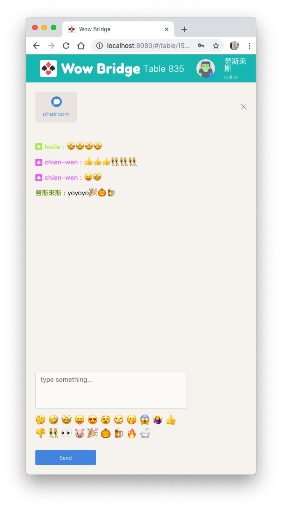
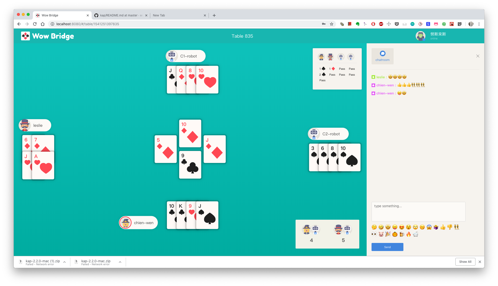

 
An online multiplayer bridge game with React, Redux and Node.js.

 
 

#### Play now: http://bridge.tw
#### Contract bridge rules: [Wiki](https://en.wikipedia.org/wiki/Contract_bridge)

 

## Technologies

* React
* Redux
* Router
* Firebase
* Webpack
* Babel
* Node.js
* AWS EC2
* Unit test: Jest

 

## Features

### Member managment

Users can sign up and login by email and password. 

### Open a new Table to play

Users can either open a new table, or select a popular table to watch.

### 

### Join

Users Can Join a table to play with your friends or play with computer agent.

### Auction

Users can select a bid in auction phase by turn.

### Play with Computer or friends

### Live chat room with viewer or players 

Players will only see messages sent by players during playing phase. Viewers can view all messages without this constraint.

### Watch people play

If a user is not a current player of a playing table, they can watch people play, and using chat room to interact with other viewer.

### 

